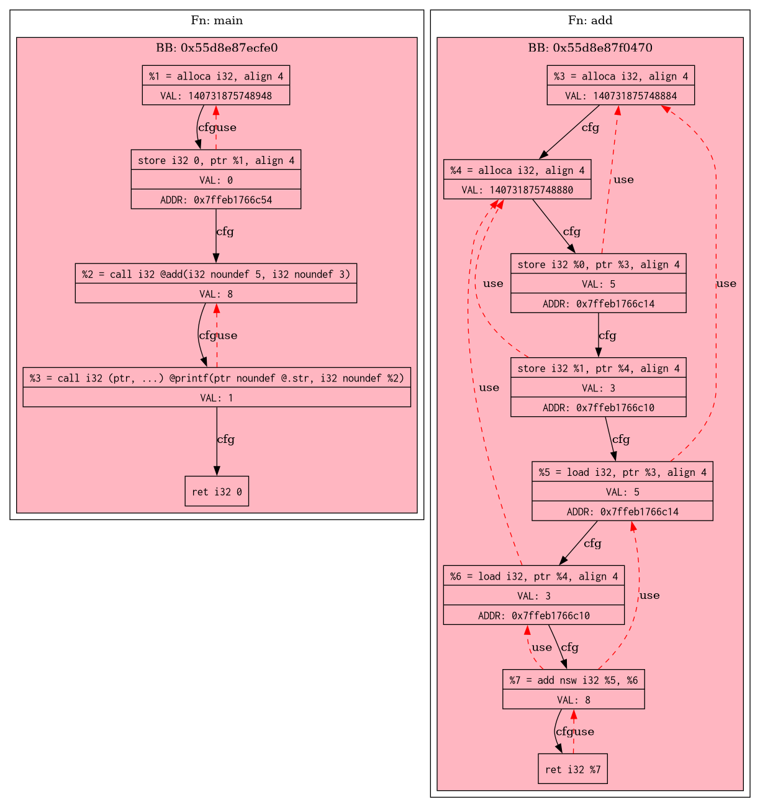

# DEF-USE GRAPH PASS-PLAGIN
This project implements an LLVM Pass Plugin that visualizes the **Def-Use** chain and Control Flow Graph (CFG) of a program, augmented with real-time values captured during execution.
- it gets instructions, dumps them to the *.dot file and generates picture of it in logs/pics/.
- graph contains:
    - instructions
    - either addr's for store and load, val's and pointers as a result of implementation of each instruction
- simultaneosly, it injects a logger functions' (defined in runtime/logger.cpp) calls after each instruction to capture values during the program execution.
- after getting values for each instruction dumped in log/values.log python script (runtime/overlay.py)
- connects them to each node on graph, creating a final visualized execution trace in in logs/pic/final.dot.

---

## Requirements
* **LLVM 14+** (including `opt` and `clang`)
* **Graphviz** (`dot` utility)
* **Python 3.x**
* **CMake 3.10+**

---

## tesing
all tests are presented in the tests/ folder.
test1.c and test3.c are using hardcoded values.
to run test with injected loggers on your own data you should paste:
```
./run --my-data
```
...to a terminal.
or use
```
./run --help
```
...for the details.
then use the following format pasting values:
```
> n // number of values in the array
> arr[n] // all values listed separatly, using line feed or space after each of them.
```
---

## how to run
### generating IR test file from our main

```
clang -S -emit-llvm tests/test<i>.c -o prog/test.ll
```
... where i is a test number.

### compiling our project

```
cmake -DCMAKE_BUILD_TYPE=debug -S . -B build && cmake --build build
```

running it on opt and saving to instrumented.ll file for disabling affect on test.ll file

```
opt -load-pass-plugin=./build/DefUsePlugin.so -passes="def-use-plugin" prog/test.ll -o prog/instrumented.ll
```
... where i is a test number.
you should see *.dot file appered in the working directory.

### compiling test program with our runtime logger
```
clang prog/instrumented.ll runtime/logger.cpp -o run
```
after running with
```
./run
```
you should see runtime.log appeared in the working directory

### overlaying values
using script on python
```
python3 runtime/overlay_json.py
```
### full console input
```
cmake -DCMAKE_BUILD_TYPE=debug -S . -B build && cmake --build build && \
opt -load-pass-plugin=./build/DefUsePlugin.so -passes="def-use-plugin" prog/test.ll -o prog/instrumented.ll && \
clang++ prog/instrumented.ll runtime/logger.cpp -o run && \
./run && \
python3 runtime/overlay_json.py && \
```
## running using bash script
```
chmod +x run_all.sh
```
then just run it
```
./run_all.sh <test_file> <args_for_test>
```
using args from description of testing
## graph example
the result of running pass-plugin on test files is the following picture:

